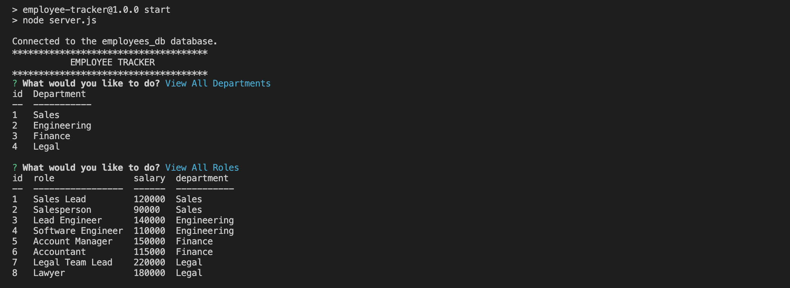
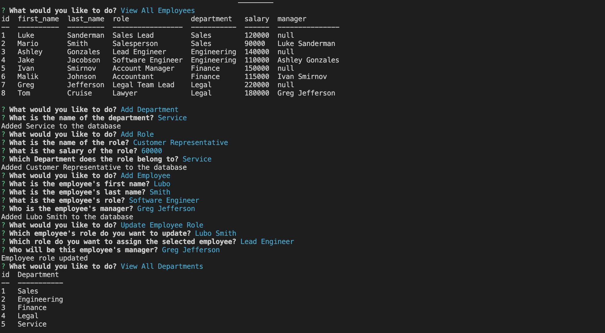
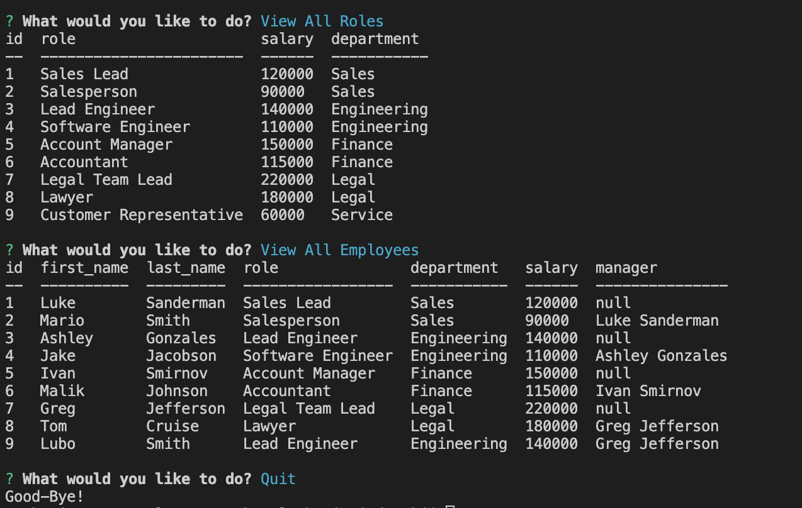

## Description

This employee-tracker aims to simplify the process of employee management for businesses, filling the gap of an accessible and user-friendly tool for handling personnel data. Developing this application, I improved my knowledge of Node.js, Inquirer, and MySQL integrations. What sets this application apart is its simple design, ensuring that those with little to no technical expertise can interact with large quantities of information, making data management easy for any business.

## Installation

1. Clone repo
2. Install inquirer, mysql2, and console.table

## Usage
1. Run `npm i` in Terminal
2. Run `npm inquirer@8.2.4 mysql2` in Terminal
3. Run `npm i console.table`
4. Run db folder in Integrated Terminal 
5. Run `mysql -u root -p` in Terminal
6. Enter the password you used in your MySQL installation
7. Run `source schema.sql` in Terminal 
8. Run `source seeds.sql` in Terminal
9. Run `quit` in Terminal
10. Launch terminal from employee-tracker folder
11. Run `npm start` in Terminal to start the application
12. Answer the view, add, and update prompts

Link to video tutorial: https://drive.google.com/file/d/1XHkMtiJUEAGwutdMJ6ja_uQJ2WdFE2u1/view?usp=sharing

## Credits

1. Andrea Hergert for inspiration https://www.youtube.com/watch?v=6G3ubKlC82c
2. MySQL2 documentation: https://www.npmjs.com/package/mysql2
3. Inquirer documentation: https://www.npmjs.com/package/inquirer
4. Node.js documentation: https://nodejs.org/api/console.html